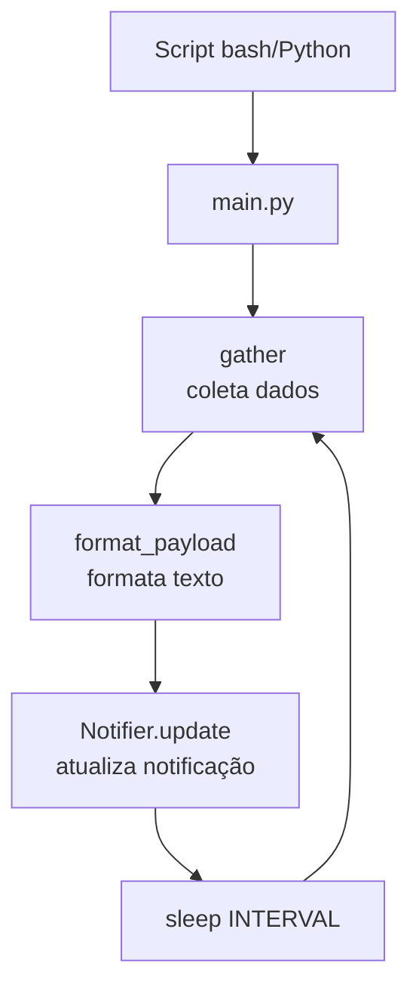

# SysMon Termux


Monitoramento do sistema Android via notificações persistentes usando Termux + Termux:API.

## 🚀 Funcionalidades
- 📊 Uso de CPU (aproximado via `top`)
- 💾 Uso de memória (RAM)
- 🔋 Status da bateria, temperatura e saúde
- 📶 Informações do SIM e operadora
- 💿 Armazenamento disponível
- 📍 Localização aproximada (via rede)
- 🔔 Notificação persistente com botões de ação

## 📋 Pré-requisitos
1. **Termux** (recomendado da F-Droid)
2. **Termux:API** (do F-Droid)
3. **Pacotes necessários**:
   ```bash
   pkg install termux-api python jq coreutils procps
   ```

## ⚙️ Instalação Rápida

```bash
# Clone o repositório (se aplicável)
# ou navegue até o diretório sysmon
git clone https://github.com/Zer0G0ld/sysmon.git
cd sysmon

# Torne os scripts executáveis
chmod +x bin/sysmon
chmod +x bin/sysmon-notify.sh

# Instale dependências Python (opcional)
pip install -r sysmon/requirements.txt

# Execute o script bash (versão simples)
./bin/sysmon-notify.sh

# OU execute a versão Python (mais recursos)
./bin/sysmon
```

## 🎯 Como Usar

### Iniciar como serviço:
```bash
# Método 1: Script bash (simples)
./bin/sysmon-notify.sh

# Método 2: Python (recomendado)
./bin/sysmon

# Para rodar em background:
nohup ./bin/sysmon > sysmon.log 2>&1 &
```

### Parar o serviço:
```bash
# Para a versão bash
pkill -f sysmon-notify.sh

# Para a versão Python
pkill -f sysmon/main.py

# OU use o botão "Parar" na notificação
```

### Ver logs:
```bash
tail -f sysmon.log
```

## 🔧 Configuração

Edite `sysmon/config.py` para ajustar:
- `INTERVAL`: Tempo entre atualizações (segundos)
- `NOTIF_ID`: ID da notificação
- `TERMUX_ACTIVITY`: Activity do Termux para o botão

## 📱 Iniciar no Boot (Opcional)

1. Instale **Termux:Boot** do F-Droid
2. Crie o diretório: `mkdir -p ~/.termux/boot`
3. Crie um script de inicialização:
   ```bash
   echo '#!/data/data/com.termux/files/usr/bin/bash
   sleep 10
   cd ~/sysmon && ./bin/sysmon' > ~/.termux/boot/start-sysmon
   chmod +x ~/.termux/boot/start-sysmon
   ```
4. Reinicie o dispositivo

## 🐛 Solução de Problemas

### "termux-comando não encontrado"
- Instale o app Termux:API do F-Droid
- Execute: `pkg install termux-api`
- Conceda permissões ao Termux no Android

### Notificação não atualiza
- Verifique se o Termux está rodando em background
- Android pode estar otimizando bateria: desative otimização para Termux

### Localização não funciona
- Ative localização no dispositivo
- Conceda permissão de localização ao Termux

## 📁 Estrutura do Projeto
```
sysmon/
├── bin/                    # Scripts executáveis
│   ├── sysmon             # Launcher Python
│   └── sysmon-notify.sh   # Versão bash
├── sysmon/                # Código Python principal
│   ├── collectors/        # Módulos de coleta
│   ├── config.py          # Configurações
│   ├── main.py            # Ponto de entrada
│   ├── notifier.py        # Gerenciador de notificações
│   └── utils.py           # Utilitários
├── sysmon.log             # Logs da aplicação
└── README.md              # Esta documentação
```

## 📝 Ciclo de Vida



## 🔒 Permissões Necessárias
- **Termux:API**: Bateria, telefonia, localização
- **Android**: Executar em segundo plano
- **Armazenamento**: Ler informações do sistema

## 🤝 Contribuindo
1. Fork o projeto
2. Crie uma branch (`git checkout -b feature/nova-funcionalidade`)
3. Commit suas mudanças (`git commit -am 'Add nova funcionalidade'`)
4. Push para a branch (`git push origin feature/nova-funcionalidade`)
5. Abra um Pull Request

## 🙏 Agradecimentos

- [Termux](https://termux.com/) pela plataforma incrível
- [Termux:API](https://github.com/termux/termux-api) pelas APIs
- Comunidade Termux pelo suporte

## 📄 Licença
[GPLv3](LICENSE)

---
⭐ Se este projeto for útil, considere dar uma estrela!

